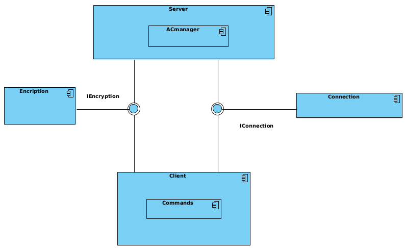
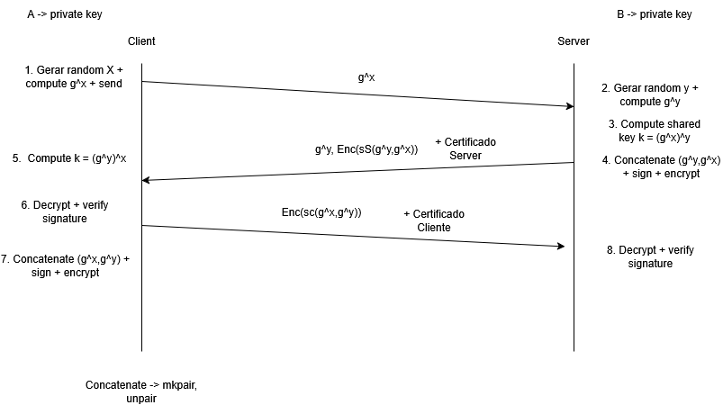

# Relatório do Projeto de Segurança de Sistemas Informáticos

## Introdução

Este relatório descreve a implementação de um serviço de Cofre Seguro que permite aos membros de uma organização armazenarem e partilharem ficheiros de texto com garantias de **autenticidade**, **integridade** e **confidencialidade**. O serviço é composto por um servidor que mantém o estado da aplicação e uma aplicações cliente para interação do utilizador com o sistema.

## Arquitetura de Segurança

A nossa arquitetura de segurança do sistema baseia-se em:

- _Autenticação mútua_ utilizando certificados X.509

- _Estabelecimento de chaves seguras_ utilizando o protocolo Station-to-Station (STS)

- _Confidencialidade_ através de criptografia simétrica AES-GCM

- _Integridade_ garantida por assinaturas digitais

- _Proteção contra ataques man-in-the-middle_ utilizando certificados e autenticação mútua.



## Certificados e Keystores

O sistema utiliza ficheiros PKCS12 (.p12) como keystores para armazenar o **certificado do utilizador**, **chave privada do utilizador** e **certificado de autoridade de certificação** (CA).

Estes ficheiros são organizados da seguinte forma na pasta projCA:

- VAULT_CA.crt - Certificado da CA raiz (auto-assinado)
- VAULT_CLIx.p12 - Keystore do cliente x (contendo certificado e chave privada)
- VAULT_CLIx.crt - Certificado do cliente x
- VAULT_CLIx.key - Chave privada do cliente x
- VAULT_SERVER.p12 - Keystore do servidor
- VAULT_SERVER.crt - Certificado do servidor
- VAULT_SERVER.key - Chave privada do servidor

## Protocolo de Handshake Seguro (Station-to-Station)

O handshake implementado segue o protocolo Station-to-Station (STS), uma variante do Diffie-Hellman com autenticação através de assinaturas digitais. Este protocolo garante autenticação mútua e estabelecimento de chaves entre cliente e servidor.



### Descrição das Etapas do Handshake:

1. Mensagem 1 (Cliente -> Servidor):
- O cliente gera um número aleatório X e calcula g^X (onde g é o gerador e p é um número primo grande).

- O cliente envia g^X ao servidor junto com o seu identificador (1,2 ou 3).

- Este valor público é enviado em formato PEM usando a biblioteca `criptography`.

2. Mensagem 2 (Servidor -> Cliente):

- O servidor gera um número aleatório Y e calcula g^Y.
- Calcula a chave partilhada k = (g^X)^Y.
- Concatena (g^Y, g^X) e assina esta concatenação com sua chave privada: S(g^Y, g^X).
- Cifra a assinatura usando AES-GCM com a chave partilhada derivada: Enc(S(g^Y, g^X)).
- Envia g^Y, a assinatura cifrada e seu certificado ao cliente.

3. Processamento no cliente (após receber mensagem 2):

- Calcula a chave partilhada k = (g^Y)^X.
- Decifra a assinatura cifrada do servidor.
- Verifica o certificado do servidor usando o certificado da CA.
- Verifica a assinatura usando a chave pública do servidor extraída do certificado.
- Se a verificação for bem-sucedida, prepara a próxima mensagem.

4. Mensagem 3 (Cliente -> Servidor):

- Concatena (g^X, g^Y) e assina esta concatenação com sua chave privada: S(g^X,g^Y).
- Cifra a assinatura usando AES-GCM com a chave partilhada derivada: Enc(S(g^X, g^Y)).
- Envia g^X, a assinatura cifrada e seu certificado ao servidor.

5. Processamento no Servidor (após receber mensagem 3):

- Decifra a assinatura cifrada do cliente.
- Verifica o certificado do cliente usando o certificado da CA.
- Extrai o pseudônimo (user_id) do certificado do cliente.
- Verifica a assinatura usando a chave pública do cliente extraída do certificado.
- Se a verificação for bem-sucedida, o handshake está completo.

Na implementação do cliente, o handshake é feito principalmente através do método `process()` da classe `Client`. Para o servidor, o handshake é implementado no método `process()` da classe `ServerWorker`.

## Gestão de Ficheiros Seguros

Após o handshake inicial e estabelecimento de canais seguros, o sistema implementa um mecanismo para gestão segura de ficheiros, incluindo operações como: `add`, `list`, `share`, `delete`, `replace`, `details`, `revoke`, `read`, `group create`, `group delete`, `group add-user`, `group delete-user`, `group list`, `group add` e `exit`.

### Troca de chaves RSA (Mensagem 3):

1. Cliente -> Servidor: 
- O cliente envia sua chave pública RSA cifrada com AES-GCM usando a chave partilhada derivada do handshake STS
- Esta chave será usada para operações de partilha segura de ficheiros.

2. Servidor -> Cliente:
- Confirma receção da chave RSA com uma mensagem também cifrada.


## Proteção Contra Ataques Man-in-the-Middle
A implementação protege contra ataques man-in-the-middle através de várias medidas de segurança:

- **Autenticação mútua com certificados X.509**:

Tanto o cliente quanto o servidor autenticam-se mutuamente usando certificados emitidos por uma CA confiável. Os certificados são verificados contra o certificado da CA (VAULT_CA.crt). A identidade de cada parte é confirmada através do campo no certificado.


- **Assinaturas digitais das chaves públicas trocadas**:

Cada parte assina a concatenação das chaves públicas Diffie-Hellman (g^X, g^Y). Isso garante que as chaves públicas não foram manipuladas durante a transmissão, logo um atacante não consegue substituir as chaves públicas sem ser detectado.


- **Derivação de chave com HKDF**:

A chave partilhada é derivada usando HKDF com SHA-256. Isso fortalece a chave resultante contra possíveis vulnerabilidades.


- **Cifra das assinaturas com AES-GCM**:

As assinaturas são cifradas com AES-GCM usando a chave partilhada AES-GCM fornece confidencialidade e integridade (autenticação). O uso de nonces aleatórios previne ataques de repetição.

## Estrutura da comunicação

A troca de mensagens em que envolve várias componentes cujos tamanhos não são fáceis de prever. Para isso, utilizámos as funções apresentadas abaixo, que incluem informação dos tamanhos na serialização de um par de bytestrings. A comunicação entre cliente e servidor é estruturada utilizando as funções `mkpair` e `unpair`, que permitem serializar e desserializar mensagens compostas. Estas funções facilitam a transmissão de múltiplos dados em uma única mensagem, como: chaves públicas DH, nonces para AES-GCM, assinaturas digitais cifradas e certificados X.509 Este formato de mensagem permite uma comunicação eficiente e segura entre as partes. 

```python
def mkpair(x, y):
    """produz uma byte-string contendo o tuplo '(x,y)' ('x' e 'y' são byte-strings)"""
    len_x = len(x)
    len_x_bytes = len_x.to_bytes(2, "little")
    return len_x_bytes + x + y

def unpair(xy):
    """extrai componentes de um par codificado com 'mkpair'"""
    len_x = int.from_bytes(xy[:2], "little")
    x = xy[2 : len_x + 2]
    y = xy[len_x + 2 :]
    return x, y
```
